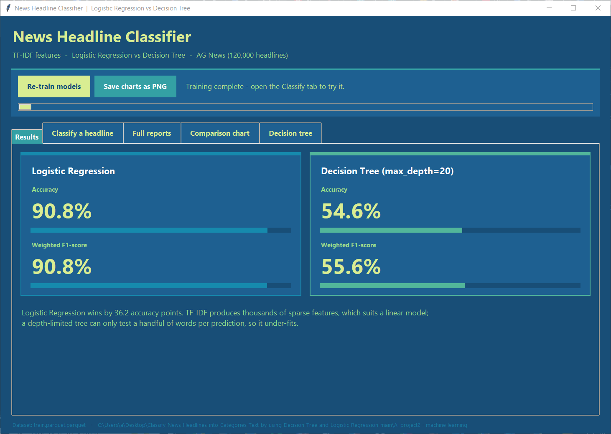
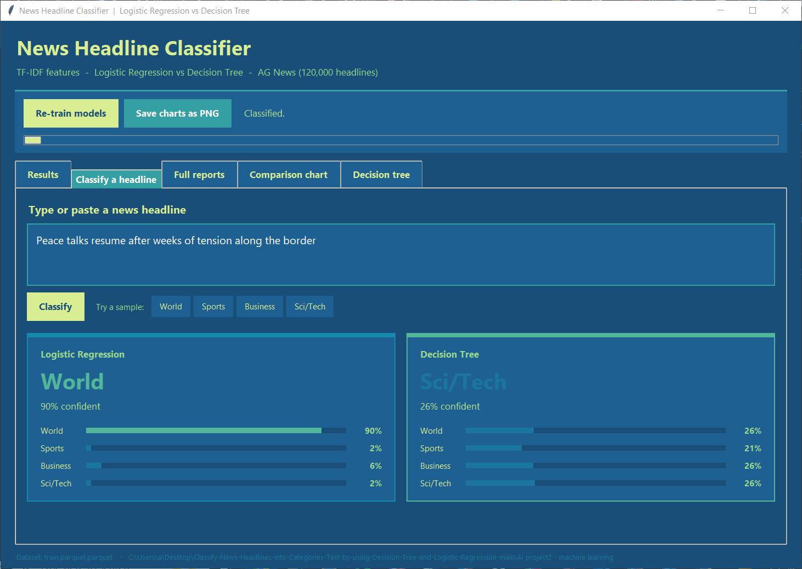
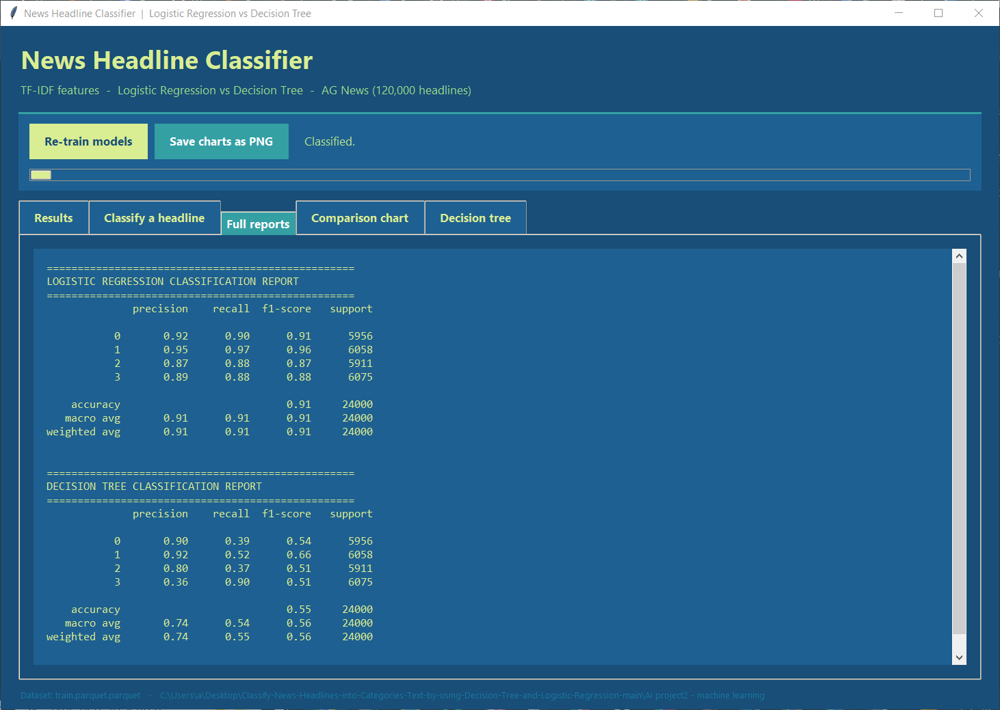
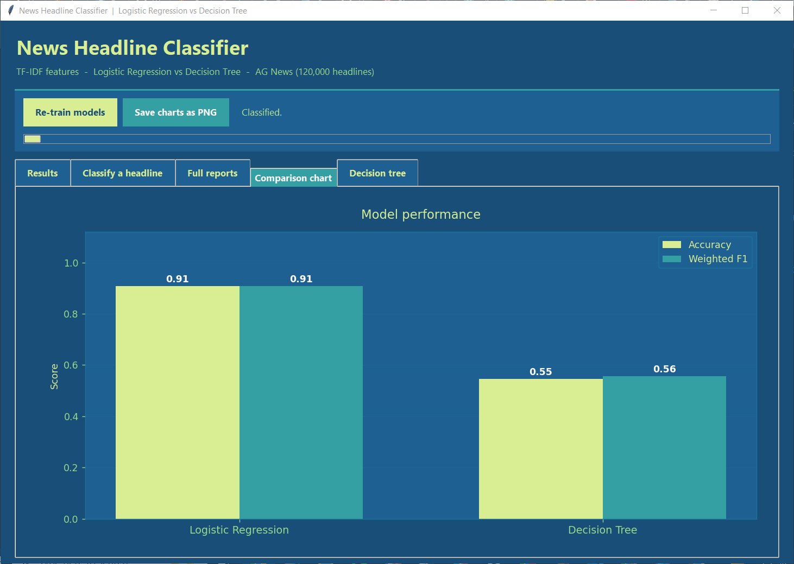
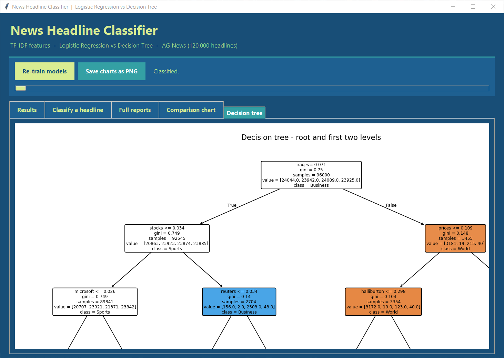

# 📰 News Headline Classifier — Decision Tree vs Logistic Regression

Classifying news headlines into **4 categories** (World 🌍 / Sports ⚽ / Business 💰 / Sci-Tech 🔬) using
TF-IDF text features, and comparing two classic supervised-learning models on exactly the same data.

Built for **COMP338 – Artificial Intelligence**, with a colourful desktop GUI so you can watch the two
models disagree in real time ^_^

| Model | Accuracy | Weighted F1 |
|---|---|---|
| 🥇 **Logistic Regression** | **90.8 %** | **90.8 %** |
| 🥈 Decision Tree (`max_depth=20`) | 54.7 % | 55.7 % |

> **Spoiler:** the tree loses by ~36 points, and the reason is *entropy* + *information gain* —
> the exact two things from the lecture notes. Full explanation below:

---

## 📸 Screenshots

### 1. Results — the scoreboard
Both models trained on the same 96,000 headlines and tested on the same 24,000.



### 2. Classify a headline 
Type any headline and both models guess it live, with their confidence for **all four** categories.



Look closely at this one — it is the whole story of the project in one picture:

* Logistic Regression says **World, 90 % confident** ✅
* The Decision Tree says **Sci/Tech, 26 % confident** ❌ ... and 26 % is basically *a random guess*
  (with 4 categories, pure guessing = 25 %). The tree is not really "deciding" here at all 🤠

### 3. Full reports — precision / recall / F1 per class
Captured straight from `classification_report()`.



### 4. Comparison chart
The same bar chart that gets exported to PNG for the report.



### 5. Decision tree — the root and first two levels
This picture is the **evidence** for why the tree fails. Keep it open while reading the next section 🔍



---

## 🚀 How to run

```bash
pip install pandas pyarrow scikit-learn matplotlib
```

**The GUI (recommended)** 🖱️

```bash
python "AI project2 - machine learning/gui.py"
```

Then click **Train models** and wait ~1 minute (it trains on a background thread, so the window will
not freeze). After that the tabs fill in and the *Classify* tab wakes up.

**The plain script** (prints the reports to the terminal and saves the two PNGs)

```bash
python "AI project2 - machine learning/main.py"
```

---

## 📁 Project structure

| File | What it does |
|---|---|
| `data_processor.py` | Loads the parquet file, lowercases + strips the text, builds **TF-IDF** features (`max_features=5000`, English stop-words removed), splits 80 / 20 |
| `train_models.py` | Trains **LogisticRegression** and **DecisionTreeClassifier(max_depth=20)**, computes accuracy + weighted F1, prints both classification reports |
| `visualizer.py` | Saves `decision_tree_graph.png` and `performance_comparison_chart.png` |
| `main.py` | Runs the whole pipeline once, in order |
| `gui.py` | The Tkinter desktop app (all 5 tabs above) — it *reuses* the files above, it does not duplicate any logic |
| `train.parquet.parquet` | The dataset: 120,000 headlines, 30,000 per category (perfectly balanced ⚖️) |

---

## 🧠 Why Logistic Regression beats the Decision Tree

Everything here is explained using the lecture notes (entropy, information gain, ID3, cost function).

### Step 1 — Remember what entropy means 📊

From the notes:

> **Entropy is used to calculate the noise in data** — in other words, measuring the
> uncertainty / chaos in a set.

$$H(S) = -p_{\oplus}\log_2 p_{\oplus} - p_{\ominus}\log_2 p_{\ominus}$$

And the two extremes from the notes:

| Set | Meaning | Entropy |
|---|---|---|
| 🟢 **Pure set** | all examples are "yes", or all are "no" | **0** (perfect certainty) |
| 🔴 **Impure set** | 3 yes / 3 no — split equally | **1** (maximum chaos) |

> The goal of the algorithm is to split the data in the way that **reduces entropy as much as possible**.

⚠️ Small note: the notes use **2 classes** (yes/no), so max entropy = 1 bit.
This project has **4 classes**, so max entropy = **2 bits**, and a "perfectly mixed" set = 25 % each.
Same idea, just a bigger scale.

### Step 2 — Remember information gain 

> **Information gain** = how much the chaos *drops* when we split on a certain attribute.

$$Gain(S, A) = H(S) - \sum_{v \in Values(A)} \frac{|S_v|}{|S|} H(S_v)$$

> **Lowest entropy = Highest info gain** 

In the play-tennis example from the notes, the tree looks at only **4 attributes**
(Outlook, Humidity, Wind, Temperature) over **14 cases**, and picks the attribute with the biggest gain:

$$Gain(S, Wind) = 0.94 - \tfrac{8}{14}(0.81) - \tfrac{6}{14}(1) = 0.048$$

That is **5.1 %** of the 0.94 bits of chaos removed — and Wind was the *weakest* of the four attributes.
Outlook was much stronger, which is why ID3 put Outlook at the root 🌳

### Step 3 — Now look at OUR tree's root node 

In our project the tree does the exact same search — but instead of 4 attributes it has to choose
between **5,000 words**, over **96,000 headlines**. Here is the winner it found (from screenshot 5):

```
                    iraq <= 0.071
                    gini = 0.75          <- maximum chaos for 4 classes
                    samples = 96000
                    value = [24044, 23942, 24089, 23925]
                              World   Sports  Business  SciTech
                            /                          \
              True (no "iraq")                          False (has "iraq")
                    /                                        \
        stocks <= 0.034                                  prices <= 0.109
        gini = 0.749   <-- meh almost UNCHANGED            gini = 0.148  <-- 🎉 nice and pure
        samples = 92545  (96.4 % of the data!)           samples = 3455  (only 3.6 %)
```

Let's apply the notes' formula to it, using entropy:

| | Entropy | Samples |
|---|---|---|
| Parent $S$ | **2.0000** bits (perfectly mixed, 4 equal classes) | 96,000 |
| Left child (no "iraq") | 1.9976 bits | 92,545 |
| Right child (has "iraq") | 0.4748 bits | 3,455 |

$$Gain(S, \text{"iraq"}) = 2.0000 - \left[\tfrac{92545}{96000}(1.9976) + \tfrac{3455}{96000}(0.4748)\right] = 0.0572 \text{ bits}$$

**That is only 2.86 % of the chaos removed.** 🤏

Read that again next to the notes: the *best word out of 5,000* is **weaker** than Wind, the *worst
attribute* in the play-tennis example (5.1 %). And this is the very first split, where the tree gets
its best possible pick!

### Step 4 — Why this keeps happening all the way down ⬇️

The word "iraq" *is* a genuinely good clue — when it appears, the headline is almost certainly World
news (gini drops to 0.148, nearly a pure set 🟢). The problem is that it only appears in **3.6 %** of
headlines. The other **96.4 %** fall into the left branch, which is still at gini 0.749 — basically as
chaotic as before we started.

Then it splits on `stocks`, and 89,841 headlines are *still* at gini 0.749. Then `microsoft`. Then...

This is the core problem: **in text, no single word decides the category.** The evidence for "this is
a Business headline" is spread thin across hundreds of weak words — *market, shares, profit, bank,
merger, quarterly...* — and a tree is only allowed to ask about **one word at a time**.

With `max_depth=20`, each headline gets a maximum of **20 yes/no questions** before it must be given
an answer. 20 words out of a 5,000-word vocabulary. That is why:

> A depth-limited tree **under-fits** — it simply runs out of questions before the set becomes pure.

### Step 5 — The proof in the classification report 🧾

Look at the Decision Tree numbers in screenshot 3:

| Class | Precision | Recall |
|---|---|---|
| 0 World | 0.90 | **0.39** |
| 1 Sports | 0.92 | **0.52** |
| 2 Business | 0.80 | **0.37** |
| 3 Sci/Tech | **0.36** | **0.90** |

See the pattern? Precision is *high* but recall is *low* for three classes, and class 3 is the
opposite. This is the tree **dumping everything it could not figure out into Sci-Tech**.

Why? Because of the leaf rule from the notes:

> **Pick the label that gives all yes!**

When a leaf is pure, that rule is great. But when the depth limit stops the tree while the leaf is
still an impure mess, the leaf just takes whatever the **majority label** is inside it — and every
headline that lands there gets that same answer, even though the leaf proves nothing.

**That is exactly what screenshot 2 shows you.** The tree answered "Sci/Tech — 26 % confident", with
World 26 %, Sports 21 %, Business 26 %. Those four numbers *are the class proportions inside the leaf
it landed in.* An impure set → entropy ≈ 2.0 bits → maximum chaos → the tree learned **nothing** about
that headline and is just reading out a coin flip 🪙

### Step 6 — Why Logistic Regression is the right tool here ✅

From the notes on regression:

$$h(x) = \theta_0 + \theta_1 x_1 + \theta_2 x_2 + \theta_3 x_3 + \dots + \theta_n x_n$$

That single line is the whole answer. **Logistic Regression looks at all 5,000 words at once**, each
with its own weight $\theta$, and adds up the evidence:

* it does *not* have to choose one word per step ✔️
* it does *not* run out of depth ✔️
* a hundred weak clues can add up to one confident decision ✔️

The notes also make the key distinction:

> **Regression** → continuous output (predicting a house price 🏠)
> **Classification** → discrete output (yes/no, or here: 4 categories)

So logistic regression takes that same weighted sum $h(x)$ and squashes it through a **sigmoid**, which
turns it into a **probability between 0 and 1** — one probability per category. Those probabilities are
literally the percentage bars you see in the *Classify* tab 📊

And just like the notes describe for linear regression, the weights are learned by
**minimising a cost function with gradient descent** — the algorithm keeps nudging every $\theta$ until
the error stops going down. (Small technical difference: linear regression uses the squared-error cost
$J(\theta) = \frac{1}{2m}\sum(h(x^i)-y^i)^2$ from the notes, while logistic regression uses *log-loss*,
because the output is a probability. The *idea* — minimise the error by gradient descent — is
identical. That is what `max_iter=1000` in the code controls: how many optimisation steps it is
allowed 🔁)

### 🏁 Summary

| | Decision Tree 🌳 | Logistic Regression 📈 |
|---|---|---|
| Features used per prediction | ~20 words (depth limit) | all 5,000 words |
| How it decides | one word at a time, highest info gain | weighted sum of every word |
| Best root split gain | 0.0572 bits = **2.86 %** of chaos | — (not applicable) |
| Behaviour when unsure | outputs the leaf's majority label | outputs a calibrated probability |
| Result | **54.7 %** | **90.8 %** |

**One-line answer:** decision trees are excellent when you have a *few strong attributes*
(like Outlook, Humidity, Wind ☀️🌧️), but text has *thousands of weak ones* — so splitting on one word
at a time barely reduces entropy, while a linear model that sums all of them wins easily ^_^

---

## 📝 Notes & limitations

* 🔬 `DecisionTreeClassifier(max_depth=20)` has no `random_state`, so its score wobbles slightly
  between runs (≈ 54.6 – 54.7 %). Logistic Regression is deterministic and always lands on 90.8 %.
* 🌳 The GUI draws only the **root + 2 levels** of the tree, and the exported PNG shows 3. The real
  tree at depth 20 is far too wide to be readable — that is a *display* limit, the model itself is
  unchanged.
* 📈 The tree could be made stronger by raising `max_depth`, or by using a Random Forest, but the
  point of this project is the **comparison**, so both models are kept at their original settings.
* 🏷️ Labels in the dataset are stored as `0,1,2,3`. They map to **World, Sports, Business, Sci/Tech**
  (standard AG News order), which is why the GUI can show real category names.
